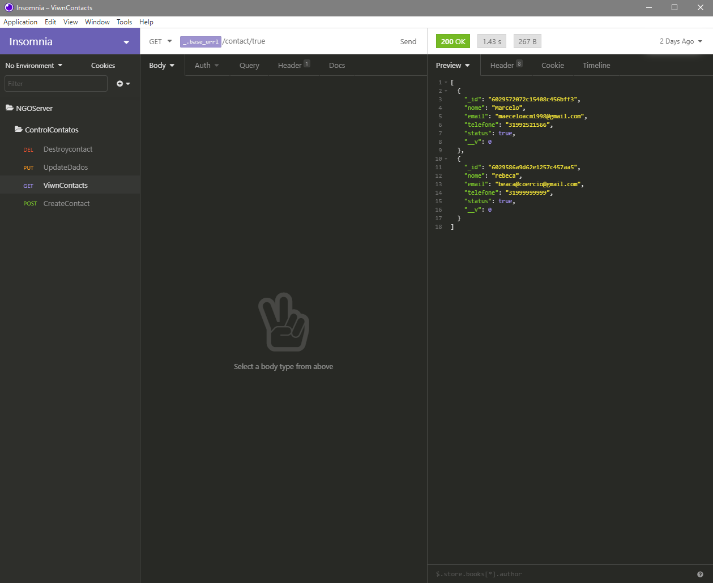

<!-- TÌTULO -->

  <!-- Imagem -->


<h1>Sobre mim:</h1>

[![LinkedIn][linkedin-shield]][linkedin-url]

<p>Me chamo Marcelo, tenho 22 anos, nasci na cidade de Belo Horizonte - MG, faço Sistemas de Informação na PUC-MG. Estou cursando o 2º período e sou apaixonado por tecnologia desde a infância, pois sempre tive contato com eletrônicos e interesse em aprender como eles funcionavam.</p>

<p>Comecei no mercado de trabalho no ano de 2018 na empresa Popular Cred, como atendente de Call Center, realizando vendas de crédito consignado do banco BMG. Fiquei por 5 meses e essa experiência desenvolveu muito a minha capacidade de comunicação. </p>

<p>No ano de 2020 iniciei na Arte Brilho como secretário no Hospital Metropolitano Dr. Célio De Castro, trabalhando na organização de documentos, agendas e atendimento ao público geral. Como ferista, passei por diversos setores da empresa, tendo que me adaptar a diversas situações e funções que me eram impostas. Foi um desafio que me agregou a habilidade para resolução de problemas, mecanismo de rápida aprendizagem diante dos treinamentos e o conhecimento próprio. Outro ponto a acrescentar é que naquele ambiente, é essencial como conduta de um funcionário, ser empático com o público e disponível para ajudar, um dos motivos que eu relaciono com o meu gosto de programar, pois enxergo que ao realizar os meus projetos, eu posso usá-los para o benefício do outro. 
 </p>
<p>Antes mesmo de entrar na faculdade, eu comecei a aprender programação através de cursos na plataforma da Udemy, como o de desenvolvimento WEB, que aborda as linguagens HTML. Ao iniciar a graduação de Sistemas de Informação na PUC-MG, eu comecei a ter diversas experiências de como são os processos de produção de uma aplicação. Realizei outros cursos da Udemy de CSS, JavaScript e continuo estudando pela plataforma os cursos de Construção de API com NODEJS, usando banco de dados NOSQL, MySQL e design de interfaces UI com foco em UX. 
</p>
<p>Dentro do ambiente estudantil desenvolvi projetos como o "Venda de máscaras", que consiste na aplicação de conceitos básicos de repetição, como For, While, Switch/Case em Java. Também o "SerachMed - Procura médica",  que foi  feito como trabalho final da matéria de Desenvolvimento Web, realizado com a ajuda de outros colegas de classe, utilizando as linguagens HTML, CSS e JavaScript, tendo como foco o armazenamento de dados no LocalStorage. </p>
<p>Sei que virão muitos desafios pela frente, que irão exigir muito foco e disciplina da minha parte, mas meu objetivo é seguir a carreira como programador Full-Stack, me especializando na linguagem de JavaScript e suas respectivas bibliotecas, como React, React Native. A programação hoje, é um trabalho que me possibilita fazer a diferença tanto para o meio empresarial, quanto ao lado humano, porque toda aplicação construída é feita para algum público e a mesma pode fazer diferença na rotina e na vida do ambiente que é inserida. Diante disso, acredito que construir algo que possa ajudar o outro na resolução de algum problema é um objetivo que a área de tecnologia pode me proporcionar e que me gerará grande satisfação.</p>


<!-- Experiência profissional -->


<hr> <!-- Linha -->

<!-- Título -->
# REST API em Node.js, Express.js - Cadastro e manipulação de contatos
> Utilizando o MongoDB para o aramazenamento dos dados

<!-- Descrição -->
Nessa aplicação foram criadas as seguintes funções: Criar contatos com nome, email e telefone, dashboard com todos contatos 
criados, deletar contatos existentes, atualizar contato existente. Foi utilizado o Node.js com arquitetura REST, em conjunto 
com o express.js para criar uma aplicação simples que crie uma lista de contatos. 

<!-- Tecnologias utilizadas -->
## Tecnologias utilizadas

- Node.js 14.15.5
- Insomnia
- MongoDB 4.4


<!-- Dependências -->
## Dependencias

- Express.js
- Cors
- Body-Parser
- Mongoose
- Nodemon (não é pré-requisito, mas facilita o uso) 

## Guia

1. Faça FORK desse projeto para o seu repositório 
2. Clone o repositório com o comando `git clone https://github.com/maeceloacm1998/NGOServerteste.git`
3. Siga o diretório cd "nome da pasta /api" no terminal usando o "cd"
4. Instalar todas as dependências utilizando `npm install dependencies`
5. Recomendo instalar o yarn, baixando no link. <a href="https://classic.yarnpkg.com/en/docs/install/#windows-stable"> Clique aqui! <a/>
5. Recomendo instalar o nodemon, utilizando `npm install nodemon`
6. Após isso rodar a aplicação utilizando `nodemon src/server.js`
7. Caso tenha instalado o Yarn, utilize `yarn dev` para rodar a aplicação.
  
## Arquitetura REST
A seguir está uma configuração generica do localhost na posta 3333.

- Lista de contatos - GET: http://localhost:3333/contact
  .Caso tenha algum contato já cadastrado no banco de dados, ele vai retornar o **NOME**, **EMAIL** e **TELEFONE** de cada um.
  
- Criação de contatos - POST: http://localhost:3333/createcontact
  .Usado para criar um contato novo contendo **NOME**, **EMAIL** e **TELEFONE** de cada contato.
  
- Lista de contatos - PUT: http://localhost:3333/update/:id_contatos'
  .Usado para atualizar o contato que você desejar. Para isso você vai inserir o _id que cada contato tem e inserir na URL depois do `update/`.  
  
- Lista de contatos - DELETE: http://localhost:3333/delete/:id_contato
  .Usado para deletar um contato da lista. Para isso você vai inserir o _id que cada contato tem e inserir na URL depois do `delete/`.
  
## Estrutura da Api REST
A estrutura da api consiste:

```
src/
│
└─ controller
   │      └─ ControllContatos.js    
   ├─ model
   │      └─ Contact.js   
   └─ app.js
   └─ routes.js
   └─ server.js
```

**####src/app.js**

Aqui encontra-se toda a estrutura da minha aplicação como a chamada para as rotas, os middlewares, a inclusão das dependências,
os constructores e a conexão com o MongoDB.

**####src/routes.js**

Aqui encontra-se todas as rotas para cada tipo de requisição.

**####src/server.js**

Aqui encontra-se apenas a porta que meu servidor local vai utilizar.

**####src/controller/ControllContatos.js**

Nessa sessão temos todas estruturas de requisição de contatos com os parametros GET, POST, PUT e DELETE.

**####src/model/Contact.js**

Nessa sessão temos o Schema e o Model dos contatos que será passado para o meu banco de dados.

# Testes
Foram totalmente realizados no ambiente automatizado do Insominia, onde foi criado uma collection com 4 testes, comprovando o sucesso de cada funcionalidade. Os testes que foram feitos nesse caso podem ser vistos na figura abaixo, logo na aba a esquerda. O Insominia é uma ferramenta extremamente útil para se testar manualmente ou automatizar os testes de qualquer API REST.


  <!-- Imagem -->

# Créditos
Essa API foi desenvolvida e documentada por Marcelo Antônio Chaves Mendes, no dia 16/02/2021.


<!-- MARKDOWN LINKS & IMAGES -->
<!-- https://www.markdownguide.org/basic-syntax/#reference-style-links -->
[linkedin-shield]: https://img.shields.io/badge/-LinkedIn-black.svg?style=for-the-badge&logo=linkedin&colorB=555
[linkedin-url]: https://www.linkedin.com/in/marcelochmendes/
[product-screenshot]: images/screenshot.png
